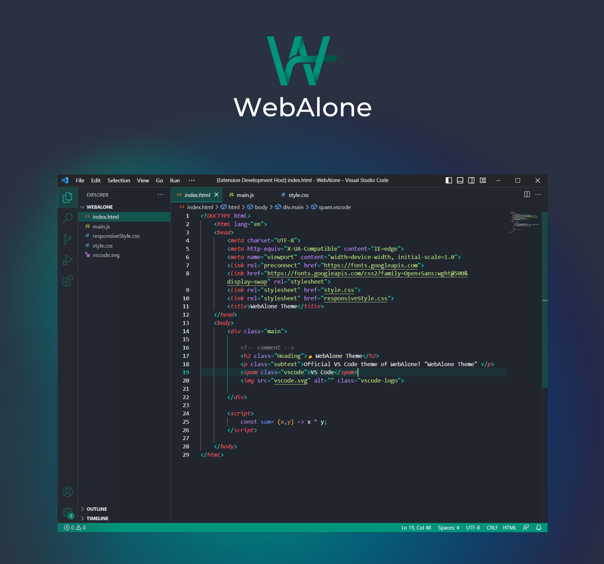
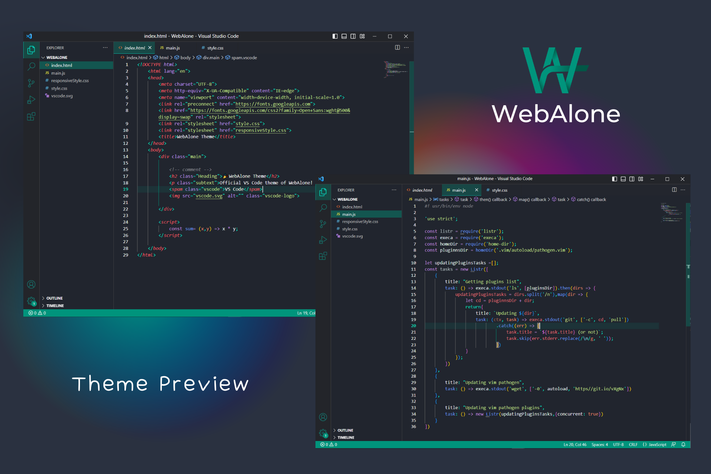

<div align="center">




</div>

<p><br></p>

## **Brought to you by**
<p><a title="Try WebAlone" href="https://github.com/Rahat-a/"> WebAlone Theme </a></br>
Official VS Code theme of WebAlone! "WebAlone Theme" is all about teaching web development skills and techniques in an efficient and practical manner. It has all the tools you need to learn the newest and most popular technologies to convert you from a no stack to full stack developer.<br> <a title="Try WebAlone" href="https://github.com/Rahat-a/">Learn More</a></p>

---

<br>
<br>

<div align="center">

# **WebAlone Theme for VS Code**
<br>



</div>

---
<br>
<br>

## **Easy Installation**

1. Open the extensions sidebar on Visual Studio Code
2. Search for **WebAlone Theme**
3. Click **Install** to install it.
4. Click **Reload** to reload your editor.
5. Code/File ＞ Preferences ＞ Color Theme ＞ **WebAlone Theme**.
6. 🌟 Enjoy and [Rate five-stars](https://marketplace.visualstudio.com/items?itemName=RahatHassan.webalone-vscode-theme&ssr=false#overview).


<br>

## Recommended settings for a better experience

```js
{
    // Controls the font family.
    "editor.fontFamily": "Fira Code",
    // Enables font ligatures
    "editor.fontLigatures": true,
}
```

---
<br>

<p align="center">Copyright &copy; 2023 <a href="https://github.com/Rahat-a/">WebAlone Theme</a></p>
<br><br><br><br>

<div align="center">

# **Enjoy!**

<div>

